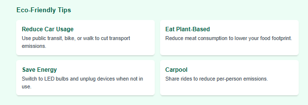
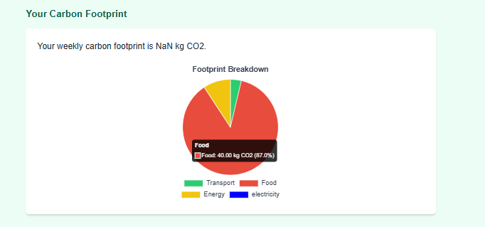

# your-carbon-dioxide-tracker

  

The Eco-Friendly Carbon Footprint Tracker is a web application that helps users calculate their annual carbon footprint based on lifestyle choices such as transportation, diet, energy consumption, flights, and waste production. Built as a single-page HTML application, it features a modern UI with Tailwind CSS, interactive charts using Chart.js, animations via Anime.js, and PDF report generation with jsPDF. This project is ideal for hackathons, educational purposes, or personal sustainability tracking.

Features

Comprehensive Inputs: Calculate emissions from car travel, public transit, meat consumption, electricity usage, annual flight hours, and weekly waste.

Visualizations:

  

Pie Chart: Breakdown of emissions by category (transport, food, energy, flights, waste).

Bar Chart: Compare your footprint to US (16,000 kg CO2/year) and global (4,000 kg CO2/year) averages.

Line Chart: Track your footprint history over time (stored in localStorage).

Goal Setting: Set and track annual CO2 reduction goals with a progress bar.
